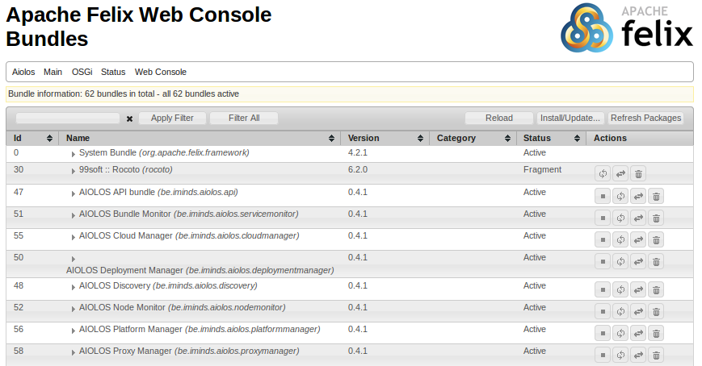
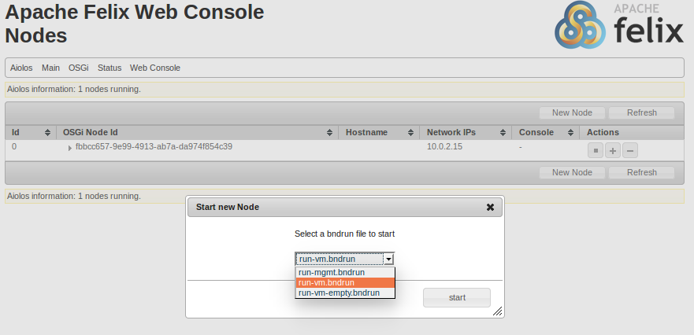
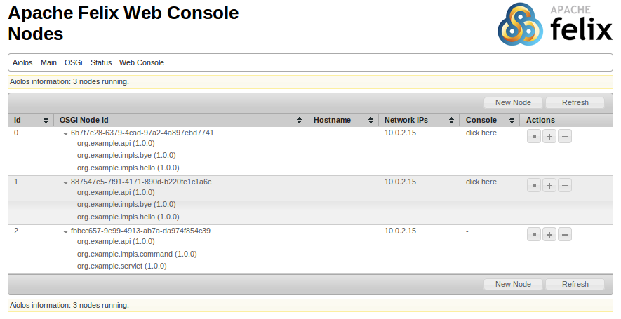
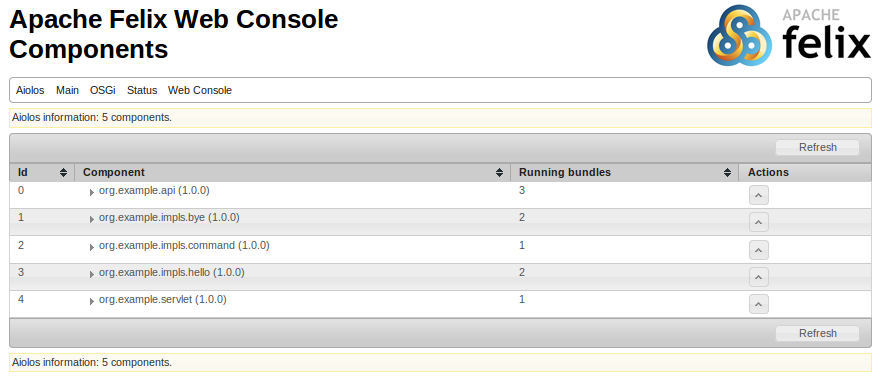
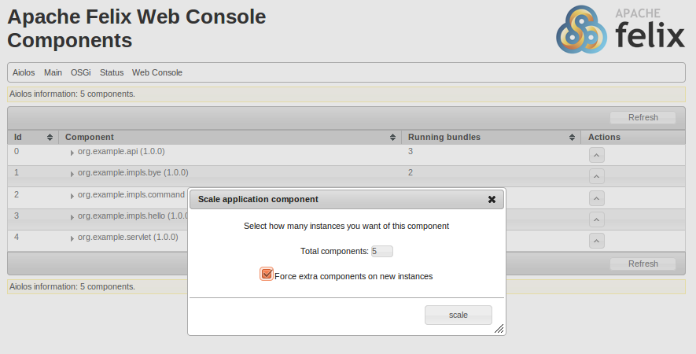

Getting started with AIOLOS
===========================

This tutorial gives step-by-step instructions to build and run your own application 
on the AIOLOS platform. Before starting, make sure you have a correct setup of the 
required development environment.

0.  Prerequisites
----------------

In order to build and run the AIOLOS framework and applications, the following is required:

- [Git](http://git-scm.com/)

- Java JDK (minimal version 1.6) i.e. [Oracle JDK](http://www.oracle.com/technetwork/java/javase/downloads/index.html) 
or [OpenJDK](http://openjdk.java.net/)

- [Apache Ant](http://ant.apache.org/) version 1.9 or higher 

To develop and build OSGi bundles, the [BND](http://www.aqute.biz/Bnd/Bnd) tool is used. 
This is included in the git repository, so no additional download is required. Although
any code editor suffices to develop for AIOLOS, we recommend the following setup:

- [Eclipse](http://www.eclipse.org/downloads/)

- [BNDTools](http://bndtools.org/) plugin for Eclipse
	The BNDTools plugin allows you to easily view and edit .bnd files used for configuring
	and building OSGi bundles. This plugin also allows you to create run configurations to
	easily test the framework on your local computer.

	BNDTools can be downloaded from the marketplace inside Eclipse. (Help > Eclipse Marketplace... > Search for BNDTools)

	A nice tutorial on how to develop OSGi applications using BNDTools is available from
	their [website](http://bndtools.org/tutorial.html).
	
The AIOLOS project also provides shell scripts to easily run your project either 
locally or on one of the supported cloud platforms.These scripts run on Mac OS X or any 
Linux based OS that has well-known tools such as `bash` installed.    	

1. Running an example application
---------------------------------

### Building and running the example application

A simple example application is provided in the `example` repository. 
To build and run this example, first clone the git repository.

		git clone git@github.com:aiolos-dev/example.git
		
Next to the example application, of course also the AIOLOS framework is required. A stable
build of the framework will be fetched automatically during the build and run process, hence
a network connection is required.

To build and run the example, simply use the ant `build` and `run` targets

		cd example
		ant clean build run
		
This will start the build process and start an OSGi instance with the AIOLOS framework.

This is the management runtime and is accessible in the browser at
`http://localhost:8080/system/console` (default user/pass: admin/admin). This shows the
webconsole where you can inspect all running bundles. 

We have provided dedicated AIOLOS tabs (drop down menu in the upper left corner) to inspect all 
nodes and components managed by this management runtime. These allow you to monitor all nodes 
and components in the framework, and to scale up or down. You can also start new nodes. When running 
locally, this will start the new nodes as separate processes on your local machine. 

Initially the *Nodes* tab contains only a so called management node. This is a node running 
AIOLOS management bundles such as `PlatformManager` and `CloudManager` that should only run on
one instance of the nodes. The management node also contains some application specific bundles, 
such as a servlet bundle that will provide a web based UI for the example greeter application. 
The exact configuration of the management node is specified in the `tools/run-mgmt.bndrun` file.
  

New nodes can be started by clicking the `New Node` button. You can select which bndrun 
configuration to use for this node. 

We have provided two additional bndrun configurations, which can also be found in the `tools` dir.
The `run-vm.bndrun` configuration will start a new node with some of the application bundles
pre-installed. The `run-vm-empty.bndrun` configuration will start a minimal AIOLOS node without
any application-specific bundles. Newly created nodes will appear in the *Nodes* tab.

On each running node components can be started and stopped using the (+) and (-) buttons on the right.
You can start any bundle that is available through the Repository service of the management node.

The *Components* tab gives an overview of all components of the application, and how many instances
are currently active. 

 

The scale (^) button on the right allows you to scale the component to a number
of instances. In the dialog you state how many instances of the component you would like to have after
the scale operation. You can force new instances on new nodes, meaning that new empty nodes will be started
even though the component could also be instantiated on the currently running nodes.

 

To have access to all commands, the *Gogo* tab offers a HTML based command line interface to the
OSGi runtime. Type `help` to get a list of available commands.

 

To see the actual example application at work, point your browser to `http://localhost:8080/greet`.
This will open the greeter servlet. Insert a name and press greet. When service instances are available on 
any of the AIOLOS nodes, these will be imported and a greeting will be displayed. Note that when using
a remote service instance, the first button press will not result yet in a greeting. This is because 
this is the first time the service is looked up, and will be used to trigger the actual import of the service.
When using for example Declarative Services, this is automatically handled for you and services should be
available from start. 

 

### Running on the cloud

To run the example in the cloud, choose a provided cloud config using the `-Dconfig` property, e.g.
		
		ant -Dconfig=ec2 run
		
This will launch a new VM instance in the cloud and provision the VM with the AIOLOS runtime. 
Make sure you provide your cloud credentials and other necessary configurations 
in the tools/configs/[your-cloud-provider] folder. When succesfully launched you will see output
like this: 

		Succesfully initialized AIOLOS management instance 
		- Access is available through the webinterface 
		(default: http://54.227.135.142:8080/system/console/aiolos-nodes user:pass admin:admin)

Browse to the management console of the OSGi runtime as you did when running locally, e.g. in this case
to `http://54.227.135.142:8080/system/console/aiolos-nodes`. This will show you the web console, just like 
when running locally. Note that instantiating new nodes on the cloud can take a while (order
of minutes).
  
To easily kill all created instances after testing, you can use the ant `kill` target

		ant -Dconfig=ec2 kill

This will clean up all instantiated VMs in the cloud for your account.

Now that you know how to build and run the example application, you can start developing your own applications.

### Running on Android

To demonstrate AIOLOS on Android, the example project contains the org.example.android project.
In order to build and run this project, you will need an Eclipse IDE with the 
[Eclipse ADT plugin](http://developer.android.com/tools/sdk/eclipse-adt.html) installed, as well
as BNDTools. Next, you also have to install our Androsgi build tools that are available [here](https://github.com/aiolos-dev/androsgi).

When the Android application is started, it will also behave as an AIOLOS node. When you have 
another node running on a computer in the same network, the SLP protocol will be used to discover
the Android device. If not, you can always manually connect to the device using the OSGi webconsole GoGo shell.
Once connected, the Android node will show up in the webconsole, and the UI can be used to start or stop
components on the Android device.   

2. Developing your own application
----------------------------------

### Forking the repository

The recommended way to develop an application for AIOLOS is to fork the `example` repo and start from there,
as this repository already contains build and run scripts to facilitate development.

The easiest way to fork the repository, is to go the the repository url on github 
[https://github.com/aiolos-dev/example](https://github.com/aiolos-dev/example) and click the fork button in the top right corner.

### Importing to Eclipse

Using Eclipse IDE with Bndtools (read the [prerequisites](#prerequisites) for instructions how to
install Eclipse IDE and Bndtools) to create your applications simplifies development. To start 
developing your new application you first need to import the projects into eclipse.

	File -> Switch workspace -> Other -> Select root folder of your application <application-name>
	File -> Import -> General -> Existing projects into workspace
	Select root directory <application-name>
	Select all projects -> Finish

Application structure (multiple projects):

- cnf

  Bndtools configuration project with all bundle repositories and ant build script template. 
  This is a mandatory project for Bndtools and should not be altered by application developers.

- tools

  This project contains all scripts and configuration files to run and deploy your application.
  Inside the `configs` folder you find configuration files for the CloudManager and Repository
  bundles to use when testing locally or running on the OpenStack cloud. It also contains a logback.xml
  file to configure the logging levels.
  The `scripts` directory contains utility scripts used to generate the workspace repository when running
  The main directory contains all available bndrun configurations to start nodes.

- org.example.api
- org.example.impls
- org.example.servlet

  Three example OSGi bundles which represent the application. In this example the impls and servlet 
  project have bndrun-files to test the application locally (thus without AIOLOS), 
  Right-click -> Run as -> Bnd OSGi Run Launcher. This will start the Apache Felix OSGi framework with 
  a GoGo shell inside Eclipse. The bundles specified inside the bndrun file will be deployed. Delete 
  or alter these example OSGi bundles to develop your own application.

- org.example.android

  An example project on how to develop an OSGi-enabled Android application. To build and run this project, 
  you will need to use our Androsgi build tools that enable to run OSGi on top of Android. Check the 
  [androsgi repository](https://github.com/aiolos-dev/androsgi) for more info.
  
To build and run your application, the same ant targets can be used as the example application.

For a more detailed description on the example application and all configuration, build and run scripts,
check the [example repository](https://github.com/aiolos-dev/example). 

3. Building and running AIOLOS from source
------------------------------------------

### Building and running AIOLOS

The source code of the AIOLOS framework itself is also available in the `mcpa` git repository. 
To build and run AIOLOS from source, first clone the `aiolos` repository

		git clone git@github.com:aiolos-dev/aiolos.git
		
To build and run from source, use the same ant targets that were used in the example application, 
e.g. to test locally on your development machine use:

		ant clean build run

### AIOLOS projects

The AIOLOS framework consists of a number of OSGi bundles, and thus the source of AIOLOS consists 
of a number of projects that can be imported into Eclipse with BNDTools similarly as the example project.

AIOLOS structure:

- cnf

  Bndtools configuration project with all bundle repositories (including necessary libraries) and ant build script template. 

- tools

  This project contains the necessary tools and configurations to easily launch your application either locally or on a cloud.

- doc

  All documentation of the AIOLOS project. You are reading it right now.
  
- site

  The aiolos.intec.ugent.be website.
  
- test

  Some basic integration tests.
	
- be.iminds.aiolos.api

  API project of AIOLOS. Includes all available interfaces to use or extend the AIOLOS framework.

- be.iminds.aiolos.platformmanager

  Provides an interface for 3rd party applications to the whole AIOLOS platform.

- be.iminds.aiolos.cloudmanager

  Offers an interface to the underlying cloud platform using the jclouds library. Contains methods to 
  start, stop, configure VMs.

- be.iminds.aiolos.servicemonitor

  Monitors services: metrics such as the number of method calls, execution time, etc. are recorded.

- be.iminds.aiolos.deploymentmanager

  Offers an interface on each node to start or stop component instances.

- be.iminds.aiolos.nodemonitor

  Monitors node-wide metrics such as CPU and memory usage, based on the Linux `/proc` filesystem.

- be.iminds.aiolos.proxymanager

  Creates proxies for each service interface, which allows to transparently outsource method calls to 
  remote instances, to capture monitoring metrics and to implement load balancing strategies.
  
- be.iminds.aiolos.remoteserviceadmin

  Implementation of the OSGi 122 RemoteServiceAdmin spec. Enables remote method calls.

- be.iminds.aiolos.repository

  Implementation of the OSGi 132 Repository spec. Enables bundle repositories to host all application bundles.

- be.iminds.aiolos.topologymanager

  Handles the exchange of endpoint descriptions between different interconnected nodes.

- be.iminds.aiolos.userinterface 

  Presents AIOLOS-specific user interface as plugin of the [Apache Felix Web Console](http://felix.apache.org/site/apache-felix-web-console.html)

- be.iminds.aiolos.launch

  This bundle is used to start a local cloudmanager to bootstrap your first node on a cloud.  